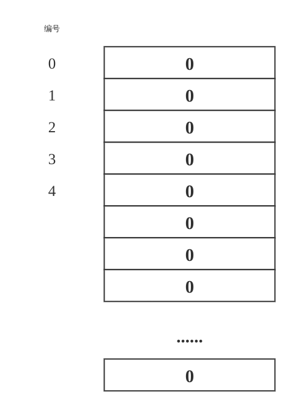
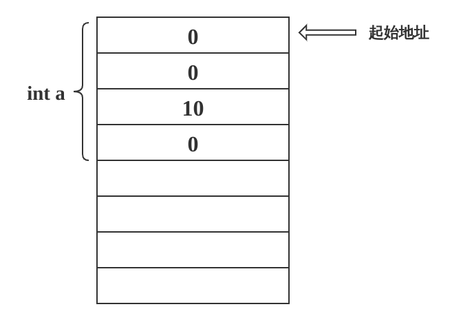

# 变量

## 变量的定义

变量就是可以变化的量,它有一个名字，你可以这样理解变量

 - 在内存上有一个“箱子”，这个“箱子”有名字，和一个编号（地址）
 - 你可以改变“箱子”里的内容（数字）

## 内存模型

{ width=50% }

- 内存可以认为一个很长的纸条
- 纸条由一个一个小格子组成
- 每个格子都有一个编号，从0开始
- 每个格子的大小是8 bit，也就是1 byte

## 变量占用的内存大小

| 类型   | 格子数 | 大小   |
|--------|--------|--------|
| bool   | 1      | 1 byte |
| char   | 1      | 1 byte |
| int    | 4      | 4 byte |
| float  | 4      | 4 byte |
| double | 8      | 8 byte |

{ width=50% }

## 内存大小转换
| 英文 | 中文     | 大小关系                        |
|------|----------|---------------------------------|
| bit  | 位       | $1 bit$也就是一个0或1占用的大小 |
| byte | 字节     | $1 byte = 8 bit$                |
| kb   | 千字节   | $1 kb = 1024 byte$              |
| mb   | 兆字节   | $1 mb = 1024 kb$                |
| gb   | 千兆字节 | $1 gb = 1024 mb$                |

