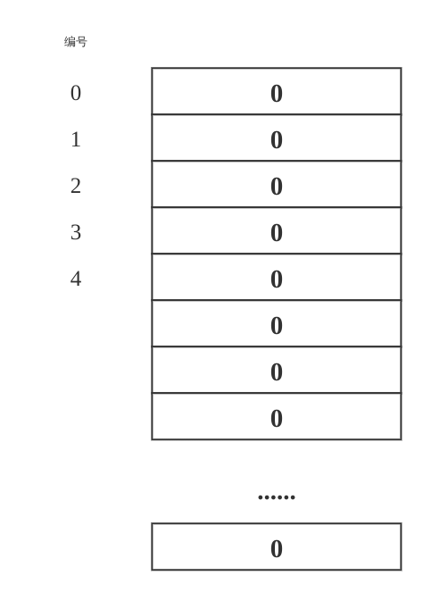
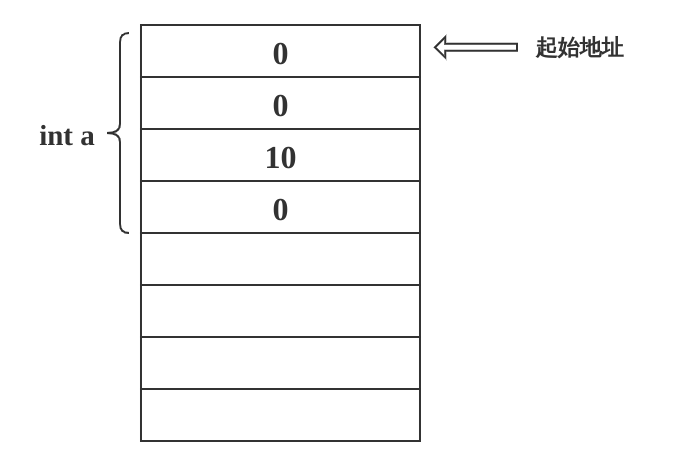

---
title: "C++急速入门"
author: [author:Rainboy]
date: "2021"
keywords: [c++]
listings-disable-line-numbers: true
listings-no-page-break: true
book: true
toc-own-page: true
titlepage: true,
titlepage-rule-color: "360049"
titlepage-background: "backgrounds/background1.pdf"
...

# 第一个程序

```c++
#include <iostream>
using namespace std;
int main(){
    cout << "Hello World!" << endl;
    return 0;
}

```
 - `iostream`是头文件，是`input output stream`的缩写。
 - 包含`iostream`头文件后，就可以使用`cout`，`cin`这两个对象了。
 - `main`是**主要**的意思，程序从`main`的第一句代码开始执行。
 - `;`号表示一句代码的结束，`;`前面可以什么也不写，表示空语句

如果编译并运行程序

1. 用`vim`写入上面的代码，保存退出(`<esc>:wq`)
2. 编译

```bash
g++ -g -o 1 helloworld.cpp
```

3. 运行

```bash
./1
```

# 注释

注释是给**人**看的，代码在执行的时候会忽略。

- `//` 单行注释，从这个符号开始到行尾都算是注释
- `/* ... */` 多行注释，被包涵的内容都算是注释

```c++
#include <cstdio>
int main(){
    // 这是单行注释
    printf("Hello World!"); // 这也是单行注释
    /* 这是注释 */
    /* 这也是
    注释 */
    return 0;
}

```

# 数字类型

$C++$有以下5种基本数据类型

| 类型     | 关键字 | printf标志 | 标志对应单词 |
|----------|--------|------------|--------------|
| 布尔型   | bool   | %d         | decimal      |
| 字符型   | char   | %c         | char         |
| 整型     | int    | %d         | decimal      |
| 浮点型   | float  | %f         | float        |
| 双浮点型 | double | %lf        | long float   |

# 输入输出

c++是c语言的进化，所以可以使用c语言的输入输出函数`scanf`，`printf`，当然c++也有它特有的输入输出方法`cin`，`cout`。
下面我看一下特有的输入输出

```c++
#include <iostream>
int main(){
    int a; //定义一个整型变量a
    std::cin >> a; // 输入一个数字
    // 把这个数字输出
    std::cout << a << std::endl;
    return 0;
}

```

如果不想每一次都在`cin,cout`之前使用`std::`这个命名空间，也可以按下面的方式来写

```c++
#include <iostream>
using namespace std;
int main(){
    int a; //定义一个整型变量a
    cin >> a; // 输入一个数字
    // 把这个数字输出
    cout << a << endl;
    return 0;
}

```

下面的我们来具体看一下如何输入输出数据


## 读取数字

```plaintext
1 1.1 2.0
3
4
5
```

c风格读取代码：

 - 输入输出时要指定标记（`%d %f %lf`）
 - 速度快
 - 读取数字的时候会略过不可见字符（空格，换行符）

```c++
#include <cstdio>

int main(){
    int a;
    scanf("%d",&a);
    printf("wo du qu shu zi shi %d\n",a); //我读取的数字是

    //读取的浮点数
    float b;
    scanf("%f",&b);
    printf("wo du qu float shu zi shi %f\n",b); //我读取的float数字是

    //读取的浮点数
    double c;
    scanf("%lf",&c);
    printf("wo du qu double shu zi shi %lf\n",c); //我读取的float数字是

    //同时读取三个数字
    int d1,d2,d3;
    scanf("%d%d%d",&d1,&d2,&d3);
    printf("%d %d %d",d1,d2,d3);

    return 0;
}

```

c++风格读取代码：

 - 输入输出时不要指定标记，根据变量的类型自动判定
 - 速度相对较慢
 - 读取数字的时候会略过不可见字符（空格，换行符）
 - 在对一些格式化的输出的时间不太好用，例如输出：`number is %8d \n\n,hello world`

```c++
#include <iostream>
using namespace std;

int main(){
    int a;
    cin >> a;
    cout << "wo du qu shu zi shi " << a << endl;

    //读取的浮点数
    float b;
    cin >> b;
    cout << "wo du qu float shu zi shi " << b << endl;

    //读取的浮点数
    double c;
    cin >> c ;
    //我读取的float数字是
    cout << "wo du qu double shu zi shi " << c << endl;

    //同时读取三个数字
    int d1,d2,d3;
    cin >> d1 >> d2 >> d3;
    cout << d1 <<" "<< d2 <<" "<< d3 << endl;
    // 快捷键 co d1 d2 d3[tab]

    return 0;
}

```


## 读取字符

无论哪种方法读取数字都会略过不可见字符（空格，换行符），但如果读取字符的时候不会

```plaintext
abc 123 8
newline
hello world
```

c风格

```c++
#include <cstdio>

int main(){
    while ( 1 ) {       //无限循环
        char c;
        scanf("%c",&c);
        printf("read char is %c\n",c);
    }
    return 0;
}

```

c++风格

```c++
#include <iostream>
using namespace std;

int main(){
    while ( 1 ) {       //无限循环
        char c;
        cin >> c;
        cout << "read char is " << c << endl;
    }
    return 0;
}

```

## 格式化输出

 - 进制相关
    - `std::hex` 16进制显示
    - `std::oct` 8进制显示
    - `std::dec` 10进制显示
 - 精度相关
    - `std::defaultfloat` 默认显示，有几位显示几个小数
    - `std::fixed` 表示浮点输出应该以固定点或小数点表示法显示，而不是以科学记数字法

    fixed 操作符与 setprecision 操作符一起使用时，setprecision 指定浮点数字的小数点后要显示的位数，而不是要显示的总有效数位数。

    - `std::setprecision(n)`
 - 宽度相关
    - `std::setw()` 指定宽度
    - `std::fill(char)` 指定填充的字符

```c++
/* author: Rainboy email: rainboylvx@qq.com  time: 2021年 04月 22日 星期四 20:52:19 CST */
#include <bits/stdc++.h>
using namespace std;
typedef long long ll;
const int maxn = 1e6+5,maxe = 1e6+5; //点与边的数量

int n,m;
/* 定义全局变量 */

int main(){
    int a = 7 ,b = 12,c = 16;
    cout << a <<" "<< b <<" "<< c << endl;
    cout << hex << a <<" "<< b <<" "<< c << endl;
    cout << oct << a <<" "<< b <<" "<< c << endl;
    cout << dec << a <<" "<< b <<" "<< c << endl;

    cout << setw(5) << a << endl;
    cout << setw(10) << b << endl;
    cout << setw(10) << setfill('!')<< b ;

    double d = 0.1234567;
    cout << d << endl;
    cout << fixed << setprecision(4) << d << endl; //四舍五入
    //cout << setprecision(4) << d << endl; //不用fixed
    cout << d << endl;
    cout << setprecision(3) ;
    cout << d << endl;

    cout << setprecision(10) << d << endl; //10位

    cout << defaultfloat << d << endl;

    return 0;
}

```

# 变量

## 变量的定义

变量就是可以变化的量,它有一个名字，你可以这样理解变量

 - 在内存上有一个“箱子”，这个“箱子”有名字，和一个编号（地址）
 - 你可以改变“箱子”里的内容（数字）

## 内存模型

{ width=50% }

- 内存可以认为一个很长的纸条
- 纸条由一个一个小格子组成
- 每个格子都有一个编号，从0开始
- 每个格子的大小是8 bit，也就是1 byte


## 变量占用的内存大小

| 类型   | 格子数 | 大小   |
|--------|--------|--------|
| bool   | 1      | 1 byte |
| char   | 1      | 1 byte |
| int    | 4      | 4 byte |
| float  | 4      | 4 byte |
| double | 8      | 8 byte |

{ width=50% }

## 内存大小转换
| 英文 | 中文     | 大小关系                        |
|------|----------|---------------------------------|
| bit  | 位       | $1 bit$也就是一个0或1占用的大小 |
| byte | 字节     | $1 byte = 8 bit$                |
| kb   | 千字节   | $1 kb = 1024 byte$              |
| mb   | 兆字节   | $1 mb = 1024 kb$                |
| gb   | 千兆字节 | $1 gb = 1024 mb$                |


# 运算符

## 定义

运算符就是可以运算的符号，常见的运算符有以下几种：

- 算术运算符
- 关系运算符
- 逻辑运算符
- 位运算符
- 赋值运算符
- 杂项运算符

## 算术运算符

| 运算符 | 描述                             | 实例             |
|--------|----------------------------------|------------------|
| +      | 把两个操作数相加                 | A + B 将得到 30  |
| -      | 从第一个操作数中减去第二个操作数 | A - B 将得到 -10 |
| *      | 把两个操作数相乘                 | A * B 将得到 200 |
| /      | 分子除以分母                     | B / A 将得到 2   |
| %      | 取模运算符，整除后的余数         | B % A 将得到 0   |
| ++     | 自增运算符，整数值增加 1         | A++ 将得到 11    |
| --     | 自减运算符，整数值减少 1         | A-- 将得到 9     |

实例：

```c++
#include <iostream>
using namespace std;

int main()
{
   int a = 21;
   int b = 10;
   int c;

   c = a + b;
   cout << "Line 1 - c 的值是 " << c << endl ;
   c = a - b;
   cout << "Line 2 - c 的值是 " << c << endl ;
   c = a * b;
   cout << "Line 3 - c 的值是 " << c << endl ;
   c = a / b;
   cout << "Line 4 - c 的值是 " << c << endl ;
   c = a % b;
   cout << "Line 5 - c 的值是 " << c << endl ;

   int d = 10;   //  测试自增、自减
   c = d++;
   cout << "Line 6 - c 的值是 " << c << endl ;

   d = 10;    // 重新赋值
   c = d--;
   cout << "Line 7 - c 的值是 " << c << endl ;
   return 0;
}

```

结果如下：

```plaintext
Line 1 - c 的值是 31
Line 2 - c 的值是 11
Line 3 - c 的值是 210
Line 4 - c 的值是 2
Line 5 - c 的值是 1
Line 6 - c 的值是 10
Line 7 - c 的值是 10
````

## 关系运算符


| 运算符 | 描述                                                           | 实例              |
|--------|----------------------------------------------------------------|-------------------|
| ==     | 检查两个操作数的值是否相等，如果相等则条件为真。               | (A == B) 不为真。 |
| !=     | 检查两个操作数的值是否相等，如果不相等则条件为真。             | (A != B) 为真。   |
| >      | 检查左操作数的值是否大于右操作数的值，如果是则条件为真。       | (A > B) 不为真。  |
| <      | 检查左操作数的值是否小于右操作数的值，如果是则条件为真。       | (A < B) 为真。    |
| >=     | 检查左操作数的值是否大于或等于右操作数的值，如果是则条件为真。 | (A >= B) 不为真。 |
| <=     | 检查左操作数的值是否小于或等于右操作数的值，如果是则条件为真。 | (A <= B) 为真。   |

实例：

```c++
#include <iostream>
using namespace std;

int main()
{
   int a = 21;
   int b = 10;
   int c ;

   if( a == b )
   {
      cout << "Line 1 - a 等于 b" << endl ;
   }
   else
   {
      cout << "Line 1 - a 不等于 b" << endl ;
   }
   if ( a < b )
   {
      cout << "Line 2 - a 小于 b" << endl ;
   }
   else
   {
      cout << "Line 2 - a 不小于 b" << endl ;
   }
   if ( a > b )
   {
      cout << "Line 3 - a 大于 b" << endl ;
   }
   else
   {
      cout << "Line 3 - a 不大于 b" << endl ;
   }
   /* 改变 a 和 b 的值 */
   a = 5;
   b = 20;
   if ( a <= b )
   {
      cout << "Line 4 - a 小于或等于 b" << endl ;
   }
   if ( b >= a )
   {
      cout << "Line 5 - b 大于或等于 a" << endl ;
   }
   return 0;
}

```

结果如下：

```plaintext
Line 1 - a 不等于 b
Line 2 - a 不小于 b
Line 3 - a 大于 b
Line 4 - a 小于或等于 b
Line 5 - b 大于或等于 a
```

## 逻辑运算符

-------------------------------------------------------------------------------------------------------------
  运算符   描述                                                       实例                                  
 -------- ---------------------------------------------------------- ----------------------------------------
  &&       称为逻辑与运算符。                                            (A && B) 为 false。                
           如果两个操作数都 true，则条件为 true。 

  `||`   称为逻辑或运算符。                                             `(A || B)` 为 true。 
         如果两个操作数中有任意一个 true，则条件为 true。               

  `!`     称为逻辑非运算符。                                             !(A && B) 为 true。 
            用来逆转操作数的逻辑状态，
            如果条件为 true 则逻辑非运算符将使其为 false。   
-------------------------------------------------------------------------------------------------------------


实例：

```c++
#include <iostream>
using namespace std;

int main()
{
   int a = 5;
   int b = 20;
   int c ;

   if ( a && b )
   {
      cout << "Line 1 - 条件为真"<< endl ;
   }
   if ( a || b )
   {
      cout << "Line 2 - 条件为真"<< endl ;
   }
   /* 改变 a 和 b 的值 */
   a = 0;
   b = 10;
   if ( a && b )
   {
      cout << "Line 3 - 条件为真"<< endl ;
   }
   else
   {
      cout << "Line 4 - 条件不为真"<< endl ;
   }
   if ( !(a && b) )
   {
      cout << "Line 5 - 条件为真"<< endl ;
   }
   return 0;
}

```

结果如下：

```plaintext
Line 1 - 条件为真
Line 2 - 条件为真
Line 4 - 条件不为真
Line 5 - 条件为真
```

## 位运算符

TODO

## 赋值运算符

下表列出了 C++ 支持的赋值运算符：

|运算符|描述|实例|
|------|----|----|
|`=`|简单的赋值运算符，把右边操作数的值赋给左边操作数|C = A + B 将把 A + B 的值赋给 C|
|`+=`|加且赋值运算符，把右边操作数加上左边操作数的结果赋值给左边操作数|C += A 相当于 C = C + A|
|`-=`|减且赋值运算符，把左边操作数减去右边操作数的结果赋值给左边操作数|C -= A 相当于 C = C - A|
|`*=`|乘且赋值运算符，把右边操作数乘以左边操作数的结果赋值给左边操作数|C *= A 相当于 C = C * A|
|`/=`|除且赋值运算符，把左边操作数除以右边操作数的结果赋值给左边操作数|C /= A 相当于 C = C / A|
|`%=`|求模且赋值运算符，求两个操作数的模赋值给左边操作数|C %= A 相当于 C = C % A|
|`<<=`|左移且赋值运算符|C <<= 2 等同于 C = C << 2|
|`>>=`|右移且赋值运算符|C >>= 2 等同于 C = C >> 2|
|`&=`|按位与且赋值运算符|C &= 2 等同于 C = C & 2|
|`^=`|按位异或且赋值运算符|C ^= 2 等同于 C = C ^ 2|
|`|=`|按位或且赋值运算符|`C |= 2 等同于 C = C | 2`|

## 杂项运算符

下表列出了 C++ 支持的其他一些重要的运算符。

| 运算符            | 描述                                                                                         |
|-------------------|----------------------------------------------------------------------------------------------|
| sizeof            | sizeof 运算符返回变量的大小。例如，sizeof(a) 将返回 4，其中 a 是整数。                       |
| Condition ? X : Y | 条件运算符。如果 Condition 为真 ? 则值为 X : 否则值为 Y。                                    |
| ,                 | 逗号运算符会顺序执行一系列运算。整个逗号表达式的值是以逗号分隔的列表中的最后一个表达式的值。 |
| &                 | 指针运算符 & 返回变量的地址。例如 &a; 将给出变量的实际地址。                                 |
| *                 | 指针运算符 * 指向一个变量。例如，*var; 将指向变量 var。                                      |

## C++ 中的运算符优先级

TODO

# 控制结构

if语句的形式有两种：

1. 没有else

```c++
if ( 条件 )
    语句1;
```

- 条件 -> `con`
- 语句1 -> `stmt1`
- 语句2 -> `stmt2`


```plaintext
             +------+
             | con  |----+
             +------+    |
                |        |
                | YES    | NO
                v        |
            +---------+  |
            |  stmt1  |  |
            +---------+  |
                         |
                +--------+
                |
                v
            后面的语句
```


样例：输入一个分数，判断是否及格，及格输出YES，否则什么也不做。

```c
#include <bits/stdc++.h>    //万能头文件
using namespace std;
typedef long long ll;

int main(){
    int a; //定义一个变量
    cin >> a;//输入一个值
    if( a >= 60)    //if只能控制后面的一句话
        cout << "YES" << endl;
    return 0;
}

```


2. 有else        

```c++
if ( 条件 )
    语句1;
else
    语句2;
```

```plaintext
                  +------+
          +-------| con  | --------+
     YES  |       +------+         | NO
          |                        |
          v                        v
      +-------+                +-------+
      | stmt1 |                | stmt2 |
      +-------+                +-------+
          |                        |
          |                        |
          +----------+------------+
                     |
                     v
                 后面的语句
```

样例：输入一个分数，判断是否及格
```
#include <bits/stdc++.h>    //万能头文件
using namespace std;
typedef long long ll;

int main(){
    int a; //定义一个变量
    cin >> a;//输入一个值
    if( a >= 60)    //if只能控制后面的一句话
        cout << "YES" << endl;
    else
        cout << "NO" << endl;
    return 0;
}

```
**注意**

 - `if`可以单独出现
 - 如果有`else`，必须要有`if`
 - `if`和`else`都只能控制后面紧跟着的一名话
    - 如果想控制多句话，用`{}`括起来，形成一个语句块
 - `if`和`else`合起来算一句话，如果没有`else`，`if`算一句话

## if 语句之间的嵌套

思想下面的几个代码的运行结果

```c++
#include <bits/stdc++.h>    //万能头文件
using namespace std;
typedef long long ll;

int main(){
    int a; //定义一个变量
    cin >> a;//输入一个值
    if( a >= 60)    //if只能控制后面的一句话
        //下面的if else 形成一句话 ，被上面的if(a>=60) 控制
        if ( a>= 70)
            printf(">= 70\n");
        else
            printf(">=60 ,< 70\n");
    else
        if( a > 30)
            printf("a > 30,a<60\n");
    return 0;
}

```
任务：编写这个代码，回答下面的问题

 - 分别输入`20，30，40，60 70 80`查看输出结果是什么，分析原因


```c++
#include <bits/stdc++.h>    //万能头文件
using namespace std;
typedef long long ll;

int main(){
    int a; //定义一个变量
    cin >> a;//输入一个值
    if( a >= 60)    //if只能控制后面的一句话
        //下面的if else 形成一句话 ，被上面的if(a>=60) 控制
        if ( a>= 70)
            printf(">= 70\n");
        else
            printf(">=60 ,< 70\n");
    else
        if( a > 30)
            printf("a > 30,a<60\n");
    return 0;
}

```

 - 分别输入`60，70，80，90`查看输出结果是什么，分析原因

**学习到：**

`if`和`else`都只能控制后面紧跟着的一名话,如果想控制多句话，用`{}`括起来，形成一个语句块

## if ... else if ...else if...

编写运行下面的代码，分别输入`50 60 75 85 95`，查看输出结果是什么，分析原因。

```c++
#include <bits/stdc++.h>    //万能头文件
using namespace std;
typedef long long ll;

int main(){
    int a; //定义一个变量
    cin >> a;//输入一个值
    if( a >= 90)
        printf("you xiu\n");
    else if ( a >= 80)
        printf("liang hao\n");
    else 
        printf("bu ji ge\n");
    return 0;
}

```

- `else`和它上面的最近的同级别的`if`配对

# 循环结构

循环有三种基本的循环：
 
 - for循环
 - while循环
 - do while循环

这三种循环本质上一样的，可以互相转换。

## for循环

语法如下

```c++
for( s1 : s2 : s3) { 
    block;
}
```
- s1,s2,s3 分别表示 语句1，语句2，语句3
- block 表示多条语句

它的执行过程如下

```plaintext
            +------+
            |  s1  | 执行一次
            +------+
               |
               v
            +------+         +------+  
      +---- |  s2  | <-------|  s3  | <---+
      |     +------+         +------+     |
      |        | YES                      |
      |        v                          |
      |    +--------+                     |
      |    |  block |---------------------+
      |    +--------+
      +-------+
              |
              v
          +-------+
          |  End  |
          +-------+
```

例子1 ：输出1到10，然后输出10到1

```c
#include <bits/stdc++.h> //万能头文件
using namespace std;

int main(){
    for(int i=1;i<=10;++i){ //输出1 到 10
        cout << i << " ";
    }
    for(int i=10;i>=1;--i) //这一行没有带括号{}，
        cout << i << " ";  //for与if 一样默认控制下面的一句话
    cout << endl;

    return 0;
}

```

例子2 ：计算1到100的和

```c
#include <bits/stdc++.h> //万能头文件
using namespace std;

int main(){
    int sum = 0; // sum 是英文[求和]的意思
    for(int i=1;i<=100;++i){ 
        sum+= i;
    }
    cout << sum << endl; // 5050
    return 0;
}

```

**特别说明：** for小括号内的三条语句都可以写成空语句，看下面的代码

代码3

```c
#include <bits/stdc++.h> //万能头文件
using namespace std;

int main(){
    int i=1;
    for( ; i < 10 ; ){
        cout << i << " ";
        i = i+2;
    } // 想一想这个for的输出结果是什么
    // 这个for的 s1 是空语句 ; 执行这名话相当于什么也什么做
    // s2 是一个判断条件
    // s3 是空语句 ; 执行这名话相当于什么也什么做
    return 0;
}

```

输出结果是：`1 3 5 7 9 `

代码4

```c
#include <bits/stdc++.h> //万能头文件
using namespace std;

int main(){
    for( ; ; ){
        cout << "hello" << endl;
    } // 想一想这个for的输出结果是什么
    // 这个for的 s1 是空语句 ; 执行这名话相当于什么也什么做
    // s2 是一个空语句 ; c++ 认为空语句的条件是真
    // s3 是空语句 ; 执行这名话相当于什么也什么做
    return 0;
}

```

输出结果是：无限输出`hello`,可以按`ctrl + c` 强制终止程序


## continue 语句

> continue ： 继续，遇到它，跳转到s3去执行

```c
#include <bits/stdc++.h> //万能头文件
using namespace std;

int main(){
    for(int i=1;i<=10;++i){
        if( i == 5)
            continue;
        cout << i << " ";
    }
    return 0;
}

```

输出结果是：`1 2 3 4 6 7 8 9 10 ` 没有5

## break 语句

> break : 打断，遇到它，终止控制break的那个for语句

```c
#include <bits/stdc++.h> //万能头文件
using namespace std;

int main(){
    for(int i=1;i<=10;++i){
        if( i == 5)
            break;
        cout << i << " ";
    }
    return 0;
}

```

输出结果是：`1 2 3 4 ` 没有5和后面的数字

## 嵌套循环

```c
#include <bits/stdc++.h> //万能头文件
using namespace std;

int main(){
    for(int i=1;i<=3;++i){
        cout << i << ": ";
        for(int j=1;j<=i;++j){
            cout << j << " ";
        }
        cout << endl;
    }
    return 0;
}

```

输出结果如下：

```plaintext
1: 1 
2: 1 2 
3: 1 2 3 
```

例子：输出9x9乘法表

```c
#include <bits/stdc++.h> //万能头文件
using namespace std;

int main(){
    for(int i=1;i<=9;++i){
        for(int j=1;j<=i;++j){
            cout << i << "x" << j << "=" << i*j << " ";
        }
        cout << endl;
    }
    return 0;
}

```


```plaintext
1x1=1 
2x1=2 2x2=4 
3x1=3 3x2=6 3x3=9 
4x1=4 4x2=8 4x3=12 4x4=16 
5x1=5 5x2=10 5x3=15 5x4=20 5x5=25 
6x1=6 6x2=12 6x3=18 6x4=24 6x5=30 6x6=36 
7x1=7 7x2=14 7x3=21 7x4=28 7x5=35 7x6=42 7x7=49 
8x1=8 8x2=16 8x3=24 8x4=32 8x5=40 8x6=48 8x7=56 8x8=64 
9x1=9 9x2=18 9x3=27 9x4=36 9x5=45 9x6=54 9x7=63 9x8=72 9x9=81 
```

# 数组
TODO

# 字符串
TODO

# 函数

TODO

# 递归
TODO
